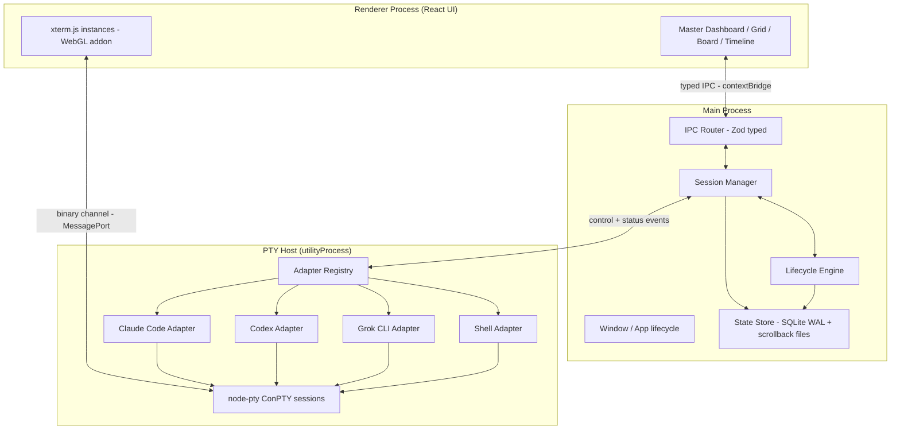
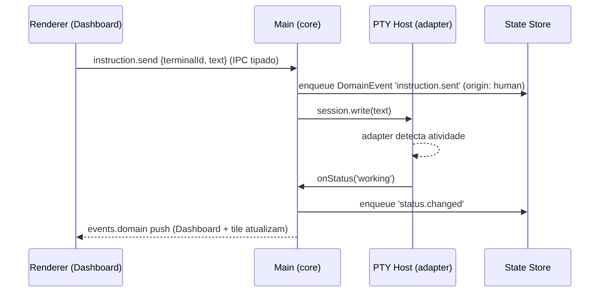
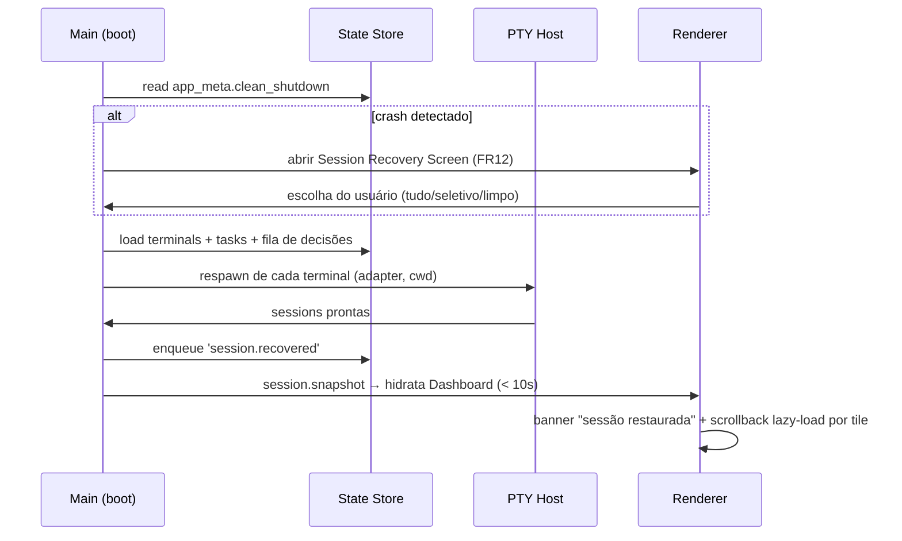

# Meu Cockpit — Fullstack Architecture Document

> **Autora:** Aria (@architect) — AIOX Fase 4 (greenfield-fullstack)
> **Insumos:** `docs/prd.md`, `docs/front-end-spec.md`
> **Status:** decisões marcadas ✅ são definitivas; marcadas 🧪 dependem de validação no spike da Story 1.1

## Introduction

Este documento define a arquitetura completa do **Meu Cockpit** — aplicação desktop local-first de orquestração multiagente. Ele traduz os 15 FRs / 8 NFRs do PRD e o front-end spec em decisões técnicas executáveis, e serve de contrato para o @dev durante o SDC.

### Change Log

| Date | Version | Description | Author |
|------|---------|-------------|--------|
| 2026-07-10 | 0.1 | Arquitetura inicial com as 4 decisões críticas | Aria (@architect) |

## High Level Architecture

### Technical Summary

Aplicação **Electron** em monorepo TypeScript com separação rígida de três planos: **Renderer** (React + xterm.js — a UI do cockpit), **Main** (janela, ciclo de vida do app, orquestração de processos) e **PTY Host** (utilityProcess dedicado que hospeda todos os PTYs e adapters — isolado para que crash de terminal nunca derrube a UI). O estado vive num **state store híbrido**: SQLite (WAL) como fonte de verdade transacional para estado estrutural + event-log, e arquivos por terminal para scrollback. Toda comunicação entre planos passa por **IPC tipado com schemas Zod**, com um canal binário dedicado de alta vazão para dados de terminal. Providers de IA são plugados exclusivamente via **Adapter Contract** — o core não conhece nenhum provider.

### Platform Choice — Decisão Crítica 1: Electron ✅ (validado por spike 🧪)

**Decisão: Electron + node-pty + xterm.js.**

| Critério | Electron | Tauri |
|----------|----------|-------|
| PTY no Windows 10 (ConPTY) | **node-pty** — maduro, é o que o VS Code usa em produção há anos | portable-pty (Rust) — sólido, porém integração menos batida com webview |
| Vazão de dados terminal → UI | MessagePort/Buffer nativos entre utilityProcess e renderer | IPC do webview historicamente sensível a alta frequência de mensagens pequenas |
| Stack do time | TypeScript ponta a ponta (Node 18+, padrão AIOX) | Exige Rust no core — segunda linguagem para time de 1 |
| Ecossistema xterm.js | Integração de referência (VS Code, Hyper, Wave Terminal) | Funciona, com mais cola manual |
| Custo (RAM/bundle) | Maior (~150-300MB RAM base) | Menor |

**Rationale:** o risco nº 1 do projeto é ConPTY no Windows 10 com ≥6 PTYs (NFR3). Electron+node-pty é o caminho com maior evidência de produção exatamente nesse cenário (VS Code no mesmo OS-alvo). TypeScript único elimina custo de contexto de Rust. O custo de RAM é aceitável para um app que hospeda 6+ CLIs pesados de qualquer forma.

**🧪 Gate de validação (Story 1.1 — spike):** 6+ PTYs ConPTY simultâneos via node-pty em Windows 10, com TUI interativa (vim + um CLI agêntico), resize e kill limpo, por 30+ min sem leak/órfãos. Se o spike falhar em critério eliminatório, fallback documentado: Tauri + portable-pty (a estrutura de pacotes abaixo sobrevive à troca — apenas `apps/desktop` e `packages/pty-host` seriam substituídos).

### High Level Architecture Diagram



### Architectural Patterns

- **Process isolation:** PTY Host em `utilityProcess` separado — crash de adapter/PTY não derruba UI nem Main; Main supervisiona e reinicia o host (alimenta FR12).
- **Event-driven core:** toda mudança de estado (status de agente, transição de lifecycle, decisão humana) é um **evento de domínio** publicado num bus interno; a timeline (FR8) é a projeção persistida desse bus — auditabilidade de graça.
- **Adapter pattern (NFR7):** especificidade de provider confinada em `packages/adapters`; core depende apenas do contrato.
- **Repository + Unit of Work sobre SQLite:** escrita transacional atômica; leitura por projeções.
- **CQRS leve na UI:** comandos via IPC request/response; estado flui para a UI por streams de eventos (nunca polling — requisito do front-end spec).

## Tech Stack

| Category | Technology | Version | Purpose | Rationale |
|----------|-----------|---------|---------|-----------|
| Language | TypeScript | 5.x (strict) | todo o código | contrato único ponta a ponta |
| Runtime | Node.js | 20 LTS | Electron main/pty-host | LTS atual, compatível Electron |
| Desktop shell | Electron | ≥ 31 | app desktop | Decisão Crítica 1 |
| PTY | node-pty | latest | ConPTY/winpty | referência de produção (VS Code) |
| Terminal render | xterm.js + @xterm/addon-webgl | 5.x | render de terminais | 60fps, NFR3 |
| UI framework | React | 18.x | renderer | ecossistema, shadcn |
| UI components | shadcn/ui + Radix | latest | design system base | recomendação da Uma, tokens-first |
| Styling | Tailwind CSS | 4.x | styling com tokens | zero hardcoded values |
| State (UI) | Zustand | 5.x | estado da UI no renderer | leve, event-friendly, sem boilerplate |
| Schemas/validação | Zod | 3.x | contratos IPC + domínio | Decisão Crítica 4 |
| Persistência | better-sqlite3 (WAL) | latest | state store | Decisão Crítica 2 |
| Build | Vite + electron-builder | latest | dev/build/package | DX rápida, packaging Windows |
| Monorepo | pnpm workspaces + Turborepo | latest | orquestração de packages | caching, pipelines |
| Unit tests | Vitest | latest | core/adapters/UI | rápido, TS nativo |
| Integration/E2E | Playwright (Electron) | latest | ciclo persist→restart→restore | AC da Story 1.4/4.2 |
| Lint/format | ESLint + Prettier | latest | qualidade | padrão AIOX |

## Data Models

> Modelagem conceitual; DDL detalhado delegado à @data-engineer se necessário (schema local simples — sem RLS/rede).

### Entidades centrais

```typescript
// packages/shared/src/domain.ts
type AgentStatus = 'idle' | 'working' | 'waiting-input' | 'done' | 'error';
type TaskState = 'planned' | 'executing' | 'awaiting-decision' | 'reviewed' | 'completed';

interface TerminalSession {
  id: string;                 // ulid
  name: string;
  adapterId: string;          // 'claude-code' | 'codex' | 'grok' | 'shell' | ...
  cwd: string;
  status: AgentStatus;
  gridPosition: GridRect;     // layout do tile
  createdAt: number;
  lastStatusChangeAt: number;
}

interface Task {
  id: string;
  title: string;
  description: string;
  state: TaskState;
  linkedTerminalIds: string[];   // FR14
  createdAt: number;
  updatedAt: number;
}

interface DomainEvent {          // a timeline (FR8) é a projeção disto
  id: string;                    // ulid — ordenável por tempo
  ts: number;
  origin: 'system' | 'agent' | 'human';
  type: string;                  // 'terminal.spawned' | 'status.changed' | 'instruction.sent'
                                 // | 'decision.made' | 'session.recovered' | 'task.transitioned' | ...
  terminalId?: string;
  taskId?: string;
  payload: Record<string, unknown>;  // validado por Zod schema por type
}

interface Decision {             // FR15
  id: string;
  taskId?: string;
  terminalId?: string;
  kind: 'approve' | 'reject' | 'redirect' | 'agent-input';
  justification?: string;
  decidedAt: number;
}
```

### Tabelas SQLite (visão lógica)

`terminals`, `tasks`, `task_terminal_links`, `events` (append-only), `decisions`, `app_meta` (schema version, flag `clean_shutdown` para detecção de crash — FR12), `settings`.

## Decisão Crítica 2: Persistência — Híbrido SQLite WAL + arquivos de scrollback ✅

**Decisão:** SQLite (better-sqlite3, WAL mode) como fonte de verdade única para estado estrutural + event-log; **scrollback fora do DB**, em arquivos append por terminal.

**Como atende NFR5 (100% survival):**
- WAL + transações atômicas: gravação parcial jamais corrompe o estado consolidado; no pior caso perde-se apenas o último batch não commitado (janela ≤ 250ms).
- `clean_shutdown` flag em `app_meta`: setada no exit gracioso, checada no boot → distingue restart de crash (FR12) e dispara a Recovery Screen.
- Estado "sessão limpa" nunca destrói dados: sessões anteriores são arquivadas (`archived_at`), atendendo o flow 3 da Uma.

**Como atende NFR8 (não-bloqueante):**
- Todos os writes passam por uma **write queue** no Main process: eventos são enfileirados e commitados em batch (flush a cada 250ms ou 100 eventos, o que vier primeiro) numa transação única — o input do usuário nunca espera I/O.
- Scrollback: ring buffer em memória por terminal (limite configurável, default 10k linhas) com flush batched para `scrollback/{terminalId}.log` (rotação por tamanho). Fora do SQLite para não inflar o DB nem competir com a write queue.

**Rejeitadas:** event-sourcing puro (replay caro no boot — inviabiliza NFR4 < 10s com timelines longas); snapshot-only JSON (sem atomicidade granular, corrupção catastrófica); a alternativa híbrida escolhida usa o event-log como *trilha* e o estado relacional como *verdade corrente* — boot lê estado direto, sem replay.

## Decisão Crítica 3: Adapter Contract (NFR7) ✅

```typescript
// packages/adapter-contract/src/index.ts
export interface AgentAdapter {
  readonly id: string;                    // 'claude-code'
  readonly displayName: string;           // 'Claude Code'
  readonly statusStrategy: 'native-hooks' | 'output-parsing' | 'process-only';
  detectAvailability(): Promise<AdapterAvailability>;  // CLI no PATH? versão? autenticado?
  spawn(config: SpawnConfig): Promise<AgentSession>;
}

export interface AgentSession {
  readonly terminalId: string;
  write(data: string): void;              // input do usuário / instruções da master (FR7)
  resize(cols: number, rows: number): void;
  dispose(): Promise<void>;               // kill limpo, sem órfãos
  onData(cb: (chunk: Buffer) => void): Unsubscribe;    // saída bruta → xterm
  onStatus(cb: (s: AgentStatus, detail?: string) => void): Unsubscribe;  // FR5
  onExit(cb: (code: number | null) => void): Unsubscribe;
}

export interface SpawnConfig {
  cwd: string;
  cols: number; rows: number;
  env?: Record<string, string>;           // NUNCA credenciais injetadas (NFR6)
  initialInstruction?: string;
}
```

**Regras do contrato:**
1. Adapters vivem no PTY Host; o core (Main) consome apenas `AgentAdapter`/`AgentSession` — dependência de provider no core é **erro de lint** (regra ESLint `no-restricted-imports` por package, verificada em CI — AC da Story 2.1).
2. **Detecção de status por camadas:** preferir `native-hooks` (ex.: hooks do Claude Code notificando via arquivo/socket local) → fallback `output-parsing` (heurísticas documentadas por adapter, com testes de fixture) → mínimo `process-only` (running/exited, caso do Shell Adapter).
3. Adapter **não intercepta credenciais** (NFR6): spawn herda o ambiente do usuário; nada de tokens em config/logs.
4. Novo provider = novo package em `packages/adapters/*` implementando o contrato + registro no `AdapterRegistry`. Guia em `docs/guides/writing-an-adapter.md` (AC Story 2.1).

## Decisão Crítica 4: IPC Tipado ✅

**Dois canais com naturezas distintas:**

1. **Canal de controle (baixa frequência, alta semântica):** request/response e eventos de domínio entre Renderer ↔ Main via `contextBridge` + `ipcRenderer.invoke`. Todos os contratos definidos em `packages/shared/src/ipc.ts` como schemas Zod — payload inválido é rejeitado na borda, nos dois sentidos:

```typescript
// exemplos de contrato (nomes canônicos)
'terminal.create'   : { in: CreateTerminalInput, out: TerminalSession }
'terminal.close'    : { in: { terminalId }, out: void }
'instruction.send'  : { in: { terminalId, text }, out: void }        // FR7
'task.transition'   : { in: { taskId, to: TaskState, justification? }, out: Task }
'decision.make'     : { in: DecisionInput, out: Decision }           // FR15
'session.snapshot'  : { in: void, out: SessionSnapshot }             // hidratação da UI
// eventos Main → Renderer (push, aria-live na fila de decisões):
'events.domain'     : DomainEvent (stream)                           // alimenta timeline/fila/status
```

2. **Canal de dados de terminal (alta vazão, binário):** `MessagePort` direto entre Renderer e PTY Host (negociado pelo Main na criação do terminal). Chunks `Buffer` sem serialização JSON, com backpressure (pause/resume do PTY quando o renderer está atrás — e taxa reduzida para terminais desfocados, conforme spec da Uma). Input de teclado segue o caminho inverso pelo mesmo port.

**Rationale:** misturar dados de PTY com IPC de controle é o erro clássico que mata a latência de digitação (NFR3 <16ms). A separação física dos canais torna o requisito estrutural, não otimização posterior.

## Components

| Package | Plano | Responsabilidade |
|---------|-------|------------------|
| `apps/desktop` | Main + Renderer entry | bootstrap Electron, janelas, wiring |
| `packages/ui` | Renderer | React app: Dashboard, Grid, Focus, Board, Recovery, Settings + design system (tokens, atoms/molecules/organisms da Uma) |
| `packages/core` | Main | Session Manager, Lifecycle Engine (máquina de estados de Task — transições válidas impostas aqui, FR13), Decision Queue, event bus |
| `packages/state-store` | Main | SQLite WAL, write queue, repositories, scrollback file manager, crash detection |
| `packages/pty-host` | utilityProcess | host de PTYs, AdapterRegistry, supervisão de sessões |
| `packages/adapter-contract` | shared | contrato + tipos (Decisão 3) |
| `packages/adapters/{shell,claude-code,codex,grok}` | PTY Host | implementações por provider |
| `packages/shared` | todos | domínio, schemas Zod de IPC, utils |

## Core Workflows

### Instrução via Master (FR7) + mudança de status



### Restart com restauração integral (FR11 / NFR4)



## Unified Project Structure

```
meu-cockpit/                    # L4 — dentro de packages/ do workspace AIOX? NÃO:
├── apps/                       # raiz do produto é o próprio repo (docs/ já existe)
│   └── desktop/                # Electron app (main + preload + renderer entry)
├── packages/
│   ├── ui/
│   ├── core/
│   ├── state-store/
│   ├── pty-host/
│   ├── adapter-contract/
│   ├── adapters/
│   │   ├── shell/
│   │   ├── claude-code/
│   │   ├── codex/
│   │   └── grok/
│   └── shared/
├── docs/                       # PRD, arquitetura, stories (AIOX)
├── package.json                # pnpm workspaces + turbo
├── turbo.json
└── tsconfig.base.json          # paths absolutos (Constitution Art. VI)
```

## Testing Strategy

- **Unit (Vitest):** `core` (máquina de estados do lifecycle, decision queue), `state-store` (write queue, atomicidade com fault injection), `adapters` (parsers de status com fixtures de output real de cada CLI).
- **Integration:** spawn real de PTY (shell adapter) em CI Windows; ciclo **persist → kill process → restore** automatizado (contrato central — Stories 1.4/4.1/4.2); supervisão do PTY Host (kill do host → recuperação).
- **E2E (Playwright-Electron):** fluxos 1–4 do front-end spec; smoke com 6 terminais ativos.
- **Métrica contínua:** benchmark de eco de digitação e time-to-resume gravado em log de diagnóstico (NFR3/NFR4 — AC Story 4.2).

## Coding Standards (críticos para agentes AIOX)

1. **Imports absolutos** via `tsconfig` paths (Constitution Art. VI).
2. **Provider isolation:** nenhum import de `adapters/*` fora do PTY Host (lint-enforced).
3. **Eventos primeiro:** mutação de estado só via evento de domínio processado pelo core — nunca write direto de UI no store.
4. **Zod na borda:** todo payload IPC validado nos dois lados; tipos inferidos do schema (nunca duplicados à mão).
5. **Sem `any`;** strict mode; erros com contexto (`Failed to {op}: {cause}`).
6. **Tokens de design apenas** — zero cores/tamanhos hardcoded em componentes (spec da Uma).

## Security & Performance

- **Local-first (NFR1):** zero telemetria; nenhum dado sai da máquina; scrollback/DB em `%APPDATA%/meu-cockpit`.
- **Electron hardening:** `contextIsolation: true`, `nodeIntegration: false`, `sandbox: true` no renderer; preload mínimo; CSP estrita; navegação externa bloqueada.
- **Credenciais (NFR6):** herdadas do ambiente do usuário pelos CLIs; nunca lidas/persistidas/logadas pelo app.
- **Performance:** canais separados (Decisão 4), WebGL rendering, render throttle para tiles desfocados, virtualização de timeline, batch writes (250ms).

## Checklist Results Report

Autoavaliação (architect-checklist resumido): ✅ todas as decisões rastreiam a FRs/NFRs específicos; ✅ risco nº1 (ConPTY) tem gate de validação com fallback definido e barato; ✅ estrutura sobrevive à troca de shell se o spike falhar; ✅ boundaries de responsabilidade claros por package; ⚠️ DDL detalhado do SQLite pode ser refinado com @data-engineer na Story 4.1 se a modelagem crescer; ⚠️ heurísticas de parsing por CLI serão descobertas empiricamente nas Stories 2.2–2.4 (fixtures obrigatórias).

## Next Steps

1. **@po (Pax):** validar consistência PRD ↔ front-end spec ↔ arquitetura (po-master-checklist) e shardar os documentos para o SDC.
2. **@sm (River):** draft da Story 1.1 (scaffold + spike ConPTY) — o spike é o primeiro item de trabalho do projeto.
3. **@dev (Dex):** implementação via SDC, respeitando os coding standards acima.
