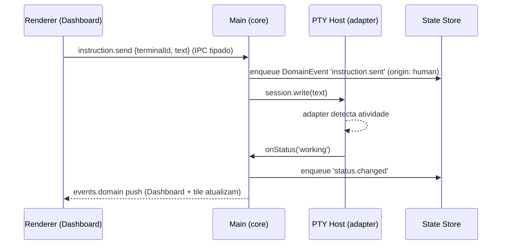
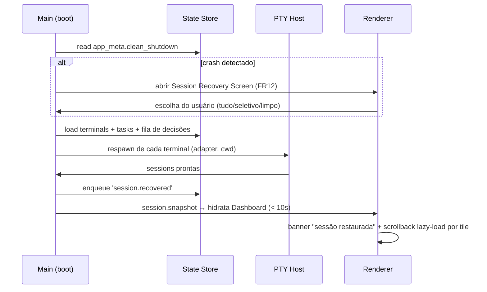

# Core Workflows

### Instrução via Master (FR7) + mudança de status

```mermaid
sequenceDiagram
    participant UI as Renderer (Dashboard)
    participant M as Main (core)
    participant PH as PTY Host (adapter)
    participant DB as State Store
    UI->>M: instruction.send {terminalId, text} (IPC tipado)
    M->>DB: enqueue DomainEvent 'instruction.sent' (origin: human)
    M->>PH: session.write(text)
    PH-->>PH: adapter detecta atividade
    PH->>M: onStatus('working')
    M->>DB: enqueue 'status.changed'
    M-->>UI: events.domain push (Dashboard + tile atualizam)
```

### Restart com restauração integral (FR11 / NFR4)

```mermaid
sequenceDiagram
    participant App as Main (boot)
    participant DB as State Store
    participant PH as PTY Host
    participant UI as Renderer
    App->>DB: read app_meta.clean_shutdown
    alt crash detectado
        App->>UI: abrir Session Recovery Screen (FR12)
        UI->>App: escolha do usuário (tudo/seletivo/limpo)
    end
    App->>DB: load terminals + tasks + fila de decisões
    App->>PH: respawn de cada terminal (adapter, cwd)
    PH->>App: sessions prontas
    App->>DB: enqueue 'session.recovered'
    App->>UI: session.snapshot → hidrata Dashboard (< 10s)
    UI->>UI: banner "sessão restaurada" + scrollback lazy-load por tile
```
