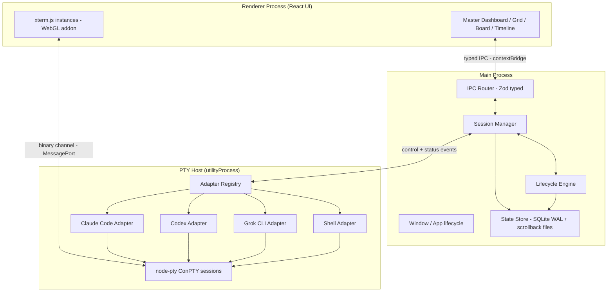

# High Level Architecture

### Technical Summary

Aplicação **Electron** em monorepo TypeScript com separação rígida de três planos: **Renderer** (React + xterm.js — a UI do cockpit), **Main** (janela, ciclo de vida do app, orquestração de processos) e **PTY Host** (utilityProcess dedicado que hospeda todos os PTYs e adapters — isolado para que crash de terminal nunca derrube a UI). O estado vive num **state store híbrido**: SQLite (WAL) como fonte de verdade transacional para estado estrutural + event-log, e arquivos por terminal para scrollback. Toda comunicação entre planos passa por **IPC tipado com schemas Zod**, com um canal binário dedicado de alta vazão para dados de terminal. Providers de IA são plugados exclusivamente via **Adapter Contract** — o core não conhece nenhum provider.

### Platform Choice — Decisão Crítica 1: Electron ✅ (spike ConPTY validado)

**Decisão: Electron + node-pty + xterm.js.**

| Critério | Electron | Tauri |
|----------|----------|-------|
| PTY no Windows 10 (ConPTY) | **node-pty** — maduro, é o que o VS Code usa em produção há anos | portable-pty (Rust) — sólido, porém integração menos batida com webview |
| Vazão de dados terminal → UI | MessagePort/Buffer nativos entre utilityProcess e renderer | IPC do webview historicamente sensível a alta frequência de mensagens pequenas |
| Stack do time | TypeScript ponta a ponta (Node 18+, padrão AIOX) | Exige Rust no core — segunda linguagem para time de 1 |
| Ecossistema xterm.js | Integração de referência (VS Code, Hyper, Wave Terminal) | Funciona, com mais cola manual |
| Custo (RAM/bundle) | Maior (~150-300MB RAM base) | Menor |

**Rationale:** o risco nº 1 do projeto é ConPTY no Windows 10 com ≥6 PTYs (NFR3). Electron+node-pty é o caminho com maior evidência de produção exatamente nesse cenário (VS Code no mesmo OS-alvo). TypeScript único elimina custo de contexto de Rust. O custo de RAM é aceitável para um app que hospeda 6+ CLIs pesados de qualquer forma.

**✅ Gate de validação (Story 1.1 — spike) — EXECUTADO E APROVADO:** 6+ PTYs ConPTY simultâneos via node-pty em Windows, com TUI interativa, resize e kill limpo, por 30+ min sem leak/órfãos. Critério original: se o spike falhasse em critério eliminatório, fallback documentado seria Tauri + portable-pty (a estrutura de pacotes abaixo sobrevive à troca — apenas `apps/desktop` e `packages/pty-host` seriam substituídos). **O fallback NÃO foi necessário.**

**Resultados medidos (corrida oficial 2026-07-13, relatório em `apps/desktop/spike/conpty-spike-report.json`):**

| Métrica | Resultado |
|---------|-----------|
| Plataforma | win32 x64, Node v25.4.0, node-pty 1.1.0 (ConPTY) |
| PTYs simultâneos | 6 (powershell.exe) |
| Duração | 30 min contínuos |
| Saídas prematuras | 0 |
| Órfãos após kill | 0 |
| RSS do host | 97.5–157.6 MB |
| (a) Estabilidade 30+ min | ✅ PASS |
| (c) Resize | ✅ PASS |
| (d) Kill limpo | ✅ PASS |
| (b) TUI interativa | ✅ validado (evidência no Dev Agent Record da Story 1.1) |

**Ruído conhecido (não-fatal):** o agente `conpty_console_list_agent` do node-pty 1.1.0 pode logar `AttachConsole failed` durante o kill quando o processo pai não tem console — sem impacto funcional nos critérios (a)/(c)/(d).

### High Level Architecture Diagram

### Architectural Patterns

- **Process isolation:** PTY Host em `utilityProcess` separado — crash de adapter/PTY não derruba UI nem Main; Main supervisiona e reinicia o host (alimenta FR12).
- **Event-driven core:** toda mudança de estado (status de agente, transição de lifecycle, decisão humana) é um **evento de domínio** publicado num bus interno; a timeline (FR8) é a projeção persistida desse bus — auditabilidade de graça.
- **Adapter pattern (NFR7):** especificidade de provider confinada em `packages/adapters`; core depende apenas do contrato.
- **Repository + Unit of Work sobre SQLite:** escrita transacional atômica; leitura por projeções.
- **CQRS leve na UI:** comandos via IPC request/response; estado flui para a UI por streams de eventos (nunca polling — requisito do front-end spec).
