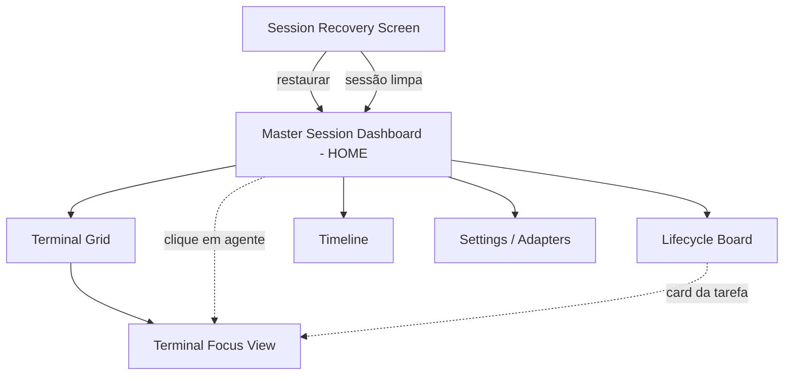
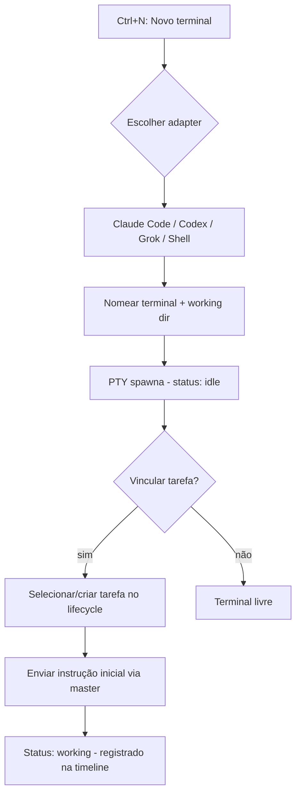
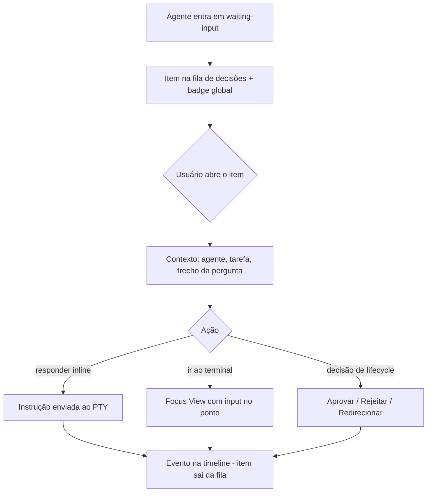
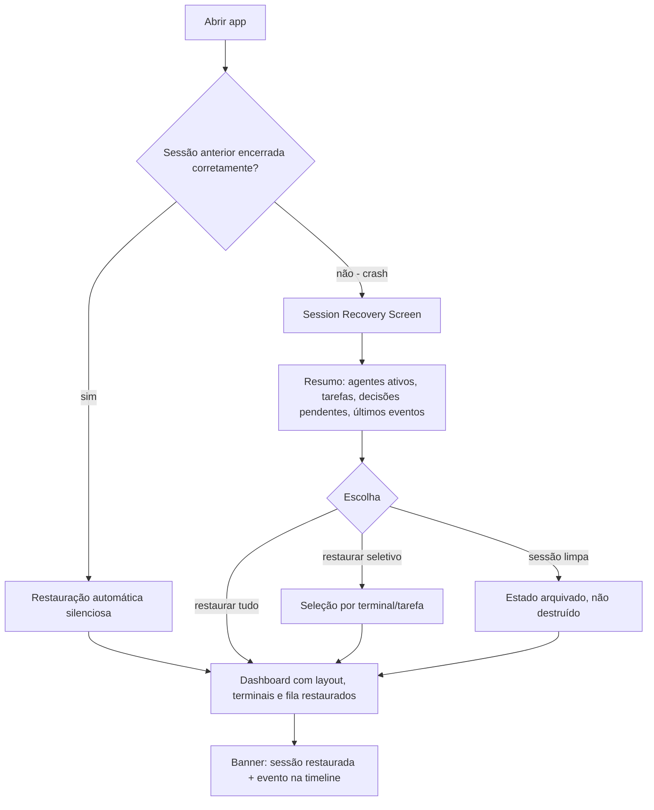
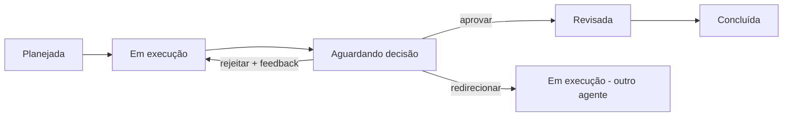

# Meu Cockpit — UI/UX Specification

> **Autora:** Uma (@ux-design-expert) — AIOX Fase 3 (greenfield-fullstack)
> **Insumos:** `docs/prd.md`, `docs/project-brief.md`, `docs/research/competitor-analysis.md`

## Introduction

Este documento define os objetivos de experiência, arquitetura de informação, fluxos de usuário e especificações visuais da interface do **Meu Cockpit**. Serve de fundação para o design visual e o desenvolvimento frontend, garantindo uma experiência coesa e centrada no usuário.

### Overall UX Goals & Principles

#### Target User Personas

- **O Orquestrador Acidental (primária):** dev profissional com 2+ assinaturas de IA (Claude Max, Codex, Grok) rodando em paralelo. Hoje vive alternando janelas e memorizando "quem faz o quê". Quer throughput sem carga mental; teme perder estado; domina teclado e odeia fricção de mouse.
- **O Governador de Squad (secundária):** dev/lead que adota metodologia agêntica (AIOX) e precisa de trilha auditável: quem aprovou o quê, qual agente executou qual tarefa, quando e por quê.

#### Usability Goals

- **Relance de 5 segundos:** ao olhar o dashboard master, o usuário entende o estado da operação inteira (quem trabalha, quem espera, o que concluiu) em ≤ 5s.
- **Zero medo de fechar:** o usuário fecha o app sem hesitar — a confiança na recuperação é absoluta e visível (indicador de estado salvo).
- **Pendência nunca esquecida:** um agente aguardando input humano fica impossível de ignorar, sem ser irritante.
- **Teclado primeiro:** todas as ações frequentes (alternar terminal, ir ao master, responder decisão) têm atalho; mouse é opcional.
- **Aprendizado imediato:** dev familiarizado com terminais completa o fluxo core (criar agente → instruir → aprovar) na primeira sessão, sem tutorial.

#### Design Principles

1. **Master-first, drill-down depois** — a home é a visão de comando; terminais são mergulhos deliberados, nunca o ponto de partida.
2. **Status é linguagem** — cor e forma de status (working/waiting/done/error/idle) são o vocabulário central da UI, consistentes em todas as telas.
3. **Calma operacional** — densidade alta de informação com hierarquia clara; nada pisca ou grita, exceto decisões pendentes.
4. **Confiança visível** — persistência e recuperação têm feedback explícito (estado salvo, sessão restaurada), transformando o contrato técnico em sensação de segurança.
5. **Governança sem fricção** — aprovar/rejeitar/redirecionar são ações de 1 tecla a partir da fila, com trilha registrada automaticamente.

### Change Log

| Date | Version | Description | Author |
|------|---------|-------------|--------|
| 2026-07-10 | 0.1 | Draft inicial a partir do PRD | Uma (@ux-design-expert) |

## Information Architecture (IA)

### Site Map / Screen Inventory

### Navigation Structure

**Primary Navigation:** barra lateral fina e fixa (ícones + tooltip): Master (home), Grid, Lifecycle Board, Timeline, Settings. Badge de contador de decisões pendentes visível na barra em qualquer tela (FR9).

**Secondary Navigation:** dentro do Grid, tabs/atalhos numéricos por terminal (`Ctrl+1..9`). No Focus View, breadcrumb leve: `Master → Terminal "nome"`.

**Breadcrumb Strategy:** breadcrumbs apenas no drill-down (Focus View e detalhe de tarefa); telas de nível 1 não usam breadcrumb.

## User Flows

### Flow 1 — Criar agente e delegar trabalho

**User Goal:** subir um agente (ex.: Claude Code) e colocá-lo para trabalhar em uma tarefa.

**Entry Points:** Dashboard (botão "Novo agente" / `Ctrl+N`), Grid.

**Success Criteria:** agente rodando com status visível no master, tarefa vinculada, instrução inicial enviada.

**Edge Cases & Error Handling:**
- CLI não instalado/autenticado → tile em estado error com mensagem do adapter e link "como resolver".
- Spawn falha (ConPTY) → retry com backoff + evento na timeline; nunca falha silenciosa.
- Limite prático de terminais atingido → aviso de performance antes de criar o 10º+.

### Flow 2 — Responder a uma decisão pendente

**User Goal:** destravar um agente que aguarda input humano, sem perder o contexto do que ele pedia.

**Entry Points:** fila de decisões no Dashboard, badge global, notificação visual do tile.

**Success Criteria:** decisão respondida em ≤ 3 interações; registro na timeline com autor/timestamp.

**Edge Cases & Error Handling:**
- Agente sai de waiting-input sozinho antes da resposta → item marcado como resolvido automaticamente (não responde a pergunta obsoleta).
- Múltiplas pendências do mesmo agente → agrupadas no mesmo item, ordenadas.
- Redirecionamento para agente ocupado → aviso com opção de enfileirar.

### Flow 3 — Fechar e retomar (restart/crash)

**User Goal:** reabrir o cockpit e continuar exatamente de onde parou, com confiança.

**Entry Points:** abertura do app após fechamento normal ou crash.

**Success Criteria:** time-to-resume < 10s (NFR4); usuário entende o que estava acontecendo antes de tocar em qualquer tecla.

**Edge Cases & Error Handling:**
- Working dir de um terminal não existe mais → tile restaurado em estado error com explicação.
- Store parcialmente corrompido → restaura último estado válido + aviso do que se perdeu (transparência total).
- Restauração lenta (> 10s) → progresso por terminal, nunca tela congelada.

### Flow 4 — Governar uma tarefa no lifecycle

**User Goal:** acompanhar uma tarefa de planejada a concluída com pontos de decisão explícitos.

**Entry Points:** Lifecycle Board, card de tarefa no Dashboard.

**Success Criteria:** transições válidas com 1 ação; trilha completa na timeline.

**Edge Cases & Error Handling:**
- Transição inválida via drag no board → card volta com shake sutil + tooltip do porquê.
- Tarefa sem agente vinculado movida para "em execução" → prompt para vincular.

## Wireframes & Mockups

**Primary Design Files:** referências visuais do fundador em `docs/design-references/` (capturas do Aiox Cockpit original, adicionadas em 2026-07-10). Alta fidelidade pode ser gerada via `*generate-ui-prompt` (v0/Lovable) na implementação.

### Design References (fornecidas pelo fundador)

- `docs/design-references/cockpit-reference-1.png` — canvas escuro com **tiles de terminal flutuantes** em tamanhos variados, cabeçalhos com acento âmbar/laranja, sidebar de navegação em árvore à esquerda e barra superior com tabs.
- `docs/design-references/cockpit-reference-2.png` — **painel de documento/spec** (Goal, Não-metas, Done — markdown renderizado) convivendo lado a lado com tiles de terminal no mesmo canvas.

**Implicações incorporadas ao spec:**
1. O "Terminal Grid" deve se comportar como **canvas com liberdade de arranjo** (tiles móveis, tamanhos livres, snap opcional) e não como grid rígido de células — mantém o FR1 (criar/nomear/redimensionar/reorganizar) com estética de canvas.
2. A **sidebar** é de navegação em árvore (sessões, tarefas, documentos) — mais larga que o rail de ícones originalmente previsto; colapsável para o modo compacto.
3. Documentos do lifecycle (spec/notas da tarefa) podem ser **abertos como painel no canvas**, lado a lado com terminais — reforça a visão de entrega agêntica (governança visível junto da execução). Painel de documento entra como tile de tipo adicional no roadmap do Épico 5.

### Key Screen Layouts

#### Master Session Dashboard (HOME)

**Purpose:** visão de comando — estado da operação inteira em um relance (meta: 5s).

**Key Elements:**
- **Fila de decisões** no topo (quando não-vazia): cards horizontais destacados com agente, tarefa, tempo aguardando e ações inline (responder / ir ao terminal / aprovar-rejeitar-redirecionar).
- **Linhas de agentes** (tabela densa): nome, adapter (ícone do provider), status com cor, tarefa vinculada, tempo no status, mini-ação "enviar instrução" (expande campo inline).
- **Rail de timeline** (coluna direita colapsável): últimos eventos em tempo real.
- Header com indicador de persistência ("● salvo há 2s") e contadores (agentes ativos / aguardando / concluídos).

**Interaction Notes:** Enter em uma linha → Focus View do terminal. `Ctrl+M` volta ao master de qualquer tela. Campo de instrução inline com `Ctrl+Enter` para enviar.

#### Terminal Grid

**Purpose:** operar múltiplos terminais lado a lado.

**Key Elements:**
- Tiles redimensionáveis/reordenáveis; cabeçalho por tile: nome editável, ícone do adapter, status colorido, tempo, menu (vincular tarefa, fechar).
- Botão/tile fantasma "+ novo terminal" (`Ctrl+N`).
- Tile em waiting-input ganha borda pulsante âmbar (única animação "insistente" permitida).

**Interaction Notes:** `Ctrl+1..9` foca terminal N; `Ctrl+Enter` expande para Focus View; drag pelo cabeçalho reordena.

#### Terminal Focus View

**Purpose:** mergulho em um agente com contexto completo.

**Key Elements:**
- Terminal em tela quase cheia (xterm), barra de contexto no topo: nome, adapter, status, tarefa vinculada (clicável).
- Painel lateral colapsável: eventos deste agente (sub-timeline) + instruções recebidas.
- Ações rápidas: vincular/desvincular tarefa, decisões de lifecycle quando aplicável.

**Interaction Notes:** `Esc` volta ao contexto anterior (Grid ou Master). Digitação vai direto ao PTY — foco de teclado pertence ao terminal por padrão.

#### Lifecycle Board

**Purpose:** pipeline de entrega por estado.

**Key Elements:**
- Colunas: Planejada / Em execução / Aguardando decisão / Revisada / Concluída.
- Cards: título, agente(s) vinculado(s) com status ao vivo, tempo na coluna.
- Coluna "Aguardando decisão" visualmente destacada (é a coluna do humano).

**Interaction Notes:** drag entre colunas = transição (validada); duplo-clique abre detalhe da tarefa; `N` cria tarefa.

#### Session Recovery Screen

**Purpose:** transformar um crash em retomada confiante.

**Key Elements:**
- Resumo empático e direto: "Sua sessão terminou inesperadamente. Aqui está onde você estava:"
- Lista do estado no momento do crash: agentes (com último status), tarefas em andamento, decisões que aguardavam.
- Três ações grandes: **Restaurar tudo** (default, Enter) / Restaurar seletivamente / Começar limpo (com nota "estado anterior fica arquivado").

**Interaction Notes:** tela modal de fluxo único; Enter = restaurar tudo. Nunca culpa o usuário; nunca mostra stack trace aqui.

#### Settings / Adapters

**Purpose:** gerenciar adapters e preferências.

**Key Elements:**
- Lista de adapters: status de disponibilidade (CLI encontrado no PATH / não encontrado), versão detectada, link de documentação.
- Preferências: limite de scrollback persistido, tema (dark default), atalhos (visualização e remapeamento pós-MVP).

**Interaction Notes:** validação de disponibilidade do CLI com feedback imediato ("testar adapter").

## Component Library / Design System

**Design System Approach:** design system próprio e enxuto, greenfield, construído sobre tokens desde o dia 1 (zero valores hardcoded) e organizado por Atomic Design. Biblioteca base recomendada: shadcn/radix (se o shell escolhido pelo @architect for web-tech) — decisão final na arquitetura frontend.

### Core Components

#### StatusBadge (atom)

**Purpose:** vocabulário central da UI — comunica estado de agente/tarefa.

**Variants:** working / waiting-input / done / error / idle (cor + ícone + label opcional).

**States:** default, pulsante (somente waiting-input), com contador de tempo.

**Usage Guidelines:** mesma semântica de cor em TODAS as telas; nunca usar as cores de status para outros fins.

#### TerminalTile (organism)

**Purpose:** container de terminal no grid.

**Variants:** shell genérico / agente (com adapter); tamanhos de grid.

**States:** focado, desfocado, waiting-input (borda pulsante), error, restaurando.

**Usage Guidelines:** cabeçalho sempre visível; conteúdo do terminal nunca coberto por overlays permanentes.

#### DecisionCard (molecule)

**Purpose:** item da fila de decisões — a unidade de governança.

**Variants:** input de agente / decisão de lifecycle (aprovar-rejeitar-redirecionar).

**States:** novo, visualizado, em resposta (campo inline aberto), resolvido (saída animada).

**Usage Guidelines:** sempre mostra contexto suficiente para decidir sem trocar de tela; ações de 1 tecla.

#### AgentRow (molecule)

**Purpose:** linha do dashboard master (agente + status + tarefa + ações).

**States:** default, hover (ações reveladas), expandida (campo de instrução), stale (sem eventos há muito tempo).

#### TimelineEvent (molecule)

**Purpose:** evento auditável (origem, timestamp, payload resumido).

**Variants:** sistema / agente / humano — origem sempre distinguível visualmente.

#### TaskCard (molecule)

**Purpose:** tarefa no Lifecycle Board.

**States:** por coluna do lifecycle; com/sem agente vinculado; com decisão pendente (destaque).

#### CommandField (atom)

**Purpose:** campo de envio de instrução a agente (master, fila, focus).

**States:** colapsado, ativo, enviando, confirmado (flash sutil), erro de envio.

## Branding & Style Guide

### Visual Identity

**Brand Guidelines:** inexistentes — direção "mission control" definida aqui como fundação. Logo/nome definitivo pós-MVP.

### Color Palette

| Color Type | Hex Code | Usage |
|------------|----------|-------|
| Primary | `#7C9CF5` (azul elétrico suave) | Ações primárias, foco, links |
| Secondary | `#22D3EE` (ciano) | Realces informativos, seleção |
| Accent | `#A78BFA` (violeta) | Elementos de governança/lifecycle |
| Success | `#34D399` | Status done, confirmações |
| Warning | `#FBBF24` (âmbar) | **waiting-input** — a cor do humano requisitado |
| Error | `#F87171` | Status error, ações destrutivas |
| Working | `#60A5FA` (azul ativo) | Status working (animação sutil de atividade) |
| Idle | `#6B7280` (cinza) | Status idle/inativo |
| Neutral | `#0B0F14` bg / `#111827` surface / `#1F2937` border / `#E5E7EB` text / `#9CA3AF` text-dim | Fundos, superfícies, bordas, textos |

> Dark theme é o único tema do MVP. Contraste mínimo 4.5:1 para texto sobre superfícies (mesmo sem meta WCAG formal).

### Typography

#### Font Families

- **Primary:** Inter (UI)
- **Secondary:** — (não há)
- **Monospace:** JetBrains Mono (terminais, IDs, timestamps, atalhos)

#### Type Scale

| Element | Size | Weight | Line Height |
|---------|------|--------|-------------|
| H1 | 24px | 600 | 32px |
| H2 | 18px | 600 | 26px |
| H3 | 15px | 600 | 22px |
| Body | 13px | 400 | 20px |
| Small | 11px | 400 | 16px |

> Escala compacta deliberada: densidade de cockpit, não de site de marketing.

### Iconography

**Icon Library:** Lucide (consistente, tree-shakeable, estética técnica).

**Usage Guidelines:** ícones de provider (Claude/Codex/Grok) sempre acompanhados do nome no primeiro uso em cada tela; status nunca comunicado só por ícone (ícone + cor + posição).

### Spacing & Layout

**Grid System:** layout de app desktop — sidebar fixa (48px) + área de conteúdo fluida; grid de terminais via CSS grid com unidades mínimas de tile (320×200px).

**Spacing Scale:** base 4px (4, 8, 12, 16, 24, 32). Densidade alta: paddings de 8–12px em componentes de dados.

## Accessibility Requirements

### Compliance Target

**Standard:** sem certificação formal no MVP (decisão do PRD); boas práticas obrigatórias abaixo.

### Key Requirements

**Visual:**
- Contraste ≥ 4.5:1 para texto; status sempre redundante (cor + ícone/posição) para daltonismo.
- Focus ring visível (2px, cor primary) em todos os elementos interativos.
- Zoom de UI (Ctrl +/-) sem quebra de layout até 150%.

**Interaction:**
- 100% das ações frequentes operáveis por teclado (princípio 4); tab order lógico.
- `prefers-reduced-motion` respeitado: borda pulsante vira borda estática destacada.
- Alvos de clique ≥ 24×24px mesmo na UI densa.

**Content:**
- Labels em todos os campos; headings hierárquicos; textos de status legíveis por screen reader (aria-live na fila de decisões).

### Testing Strategy

Checklist manual de teclado + contraste por release; auditoria automatizada (axe) integrada pós-MVP.

## Responsiveness Strategy

> App desktop-only: "responsividade" = tamanhos de janela, não devices.

### Breakpoints

| Breakpoint | Min Width | Max Width | Target Devices |
|------------|-----------|-----------|----------------|
| Compact | 1024px | 1365px | laptop pequeno, janela lado a lado |
| Standard | 1366px | 1919px | laptop/desktop comum (alvo primário) |
| Wide | 1920px | - | monitor grande/ultrawide |

Janela mínima suportada: 1024×640.

### Adaptation Patterns

**Layout Changes:** Compact colapsa o rail de timeline e reduz colunas visíveis do board (scroll horizontal); Wide permite master + grid lado a lado (split).

**Navigation Changes:** sidebar sempre presente (é fina); nunca vira hamburger.

**Content Priority:** fila de decisões nunca é sacrificada — em Compact ela vira barra compacta fixa no topo.

**Interaction Changes:** nenhum — atalhos idênticos em todos os tamanhos.

## Animation & Micro-interactions

### Motion Principles

Movimento comunica estado, nunca decora. Durações curtas (120–200ms), easing padrão `ease-out`. Uma única animação persistente na UI inteira: a borda pulsante de waiting-input. Tudo respeita `prefers-reduced-motion`.

### Key Animations

- **Waiting pulse:** borda âmbar pulsante em tile/card aguardando humano (Duration: 1.6s loop, Easing: ease-in-out)
- **Status transition:** crossfade de cor/ícone do StatusBadge (Duration: 150ms, Easing: ease-out)
- **Decision resolved:** card da fila colapsa e desliza para fora (Duration: 200ms, Easing: ease-in)
- **Saved indicator:** micro-flash do "● salvo" no header a cada persist (Duration: 120ms, Easing: linear)
- **Invalid transition shake:** card do board retorna com shake sutil (Duration: 180ms, Easing: ease-out)
- **Session restored banner:** entrada suave do topo, auto-dismiss em 5s (Duration: 200ms, Easing: ease-out)

## Performance Considerations

### Performance Goals

- **Page Load:** app interativo < 3s; retomada completa de sessão < 10s (NFR4).
- **Interaction Response:** eco de digitação no terminal < 16ms (sem lag perceptível — NFR3); ações de UI < 100ms.
- **Animation FPS:** 60fps; render de terminal com aceleração (WebGL addon) com ≥ 6 PTYs ativos.

### Design Strategies

Virtualização da timeline e do scrollback visível; atualizações de status por evento (não polling de UI); renderização de terminais desfocados com taxa reduzida; nenhuma sombra/blur custoso em áreas de alta frequência de repaint (tiles).

## Next Steps

### Immediate Actions

1. Revisão deste spec pelo fundador (ponto de decisão humana do lifecycle).
2. Handoff ao @architect: arquitetura fullstack + frontend consumindo este spec (componentes, tokens, IPC de eventos de status).
3. Na implementação do Épico 1: `*setup` (estrutura do design system + tokens) antes do primeiro componente; alta fidelidade via `*generate-ui-prompt` se desejado.

### Design Handoff Checklist

- [x] All user flows documented (4 fluxos críticos)
- [x] Component inventory complete (7 componentes core, Atomic Design)
- [x] Accessibility requirements defined (boas práticas, sem certificação formal)
- [x] Responsive strategy clear (janelas desktop: Compact/Standard/Wide)
- [x] Brand guidelines incorporated (direção "mission control" fundada aqui)
- [x] Performance goals established (alinhados a NFR3/NFR4)

## Checklist Results

Autoavaliação: spec cobre todas as Core Screens do PRD (Dashboard, Grid, Focus, Board, Recovery, Settings), todos os paradigmas (master-first, fila de decisões, timeline, teclado) e traduz FR6–FR15 em componentes e fluxos. Pendências deliberadas: alta fidelidade visual (Figma/AI) e remapeamento de atalhos ficam para a implementação.
